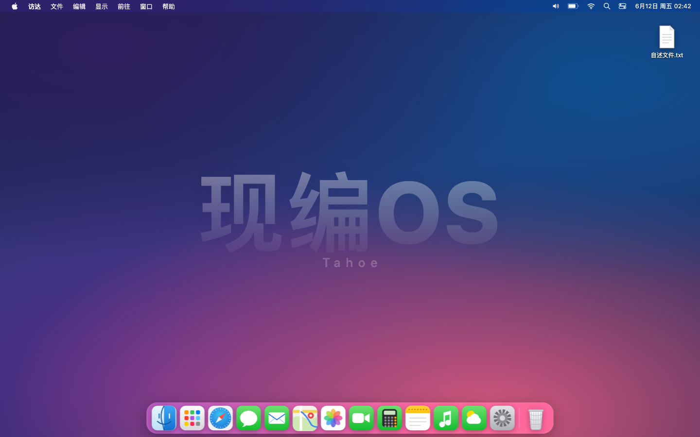
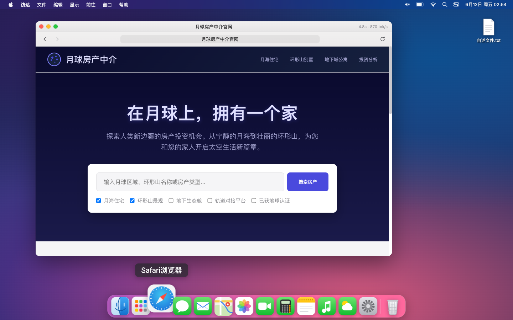

<div align="center">


# 现编OS

**一台不预装任何软件的电脑。你打开的每一个应用，都是 AI 当场现编的。**

ImprovOS — a web "operating system" where every app is improvised by AI, live, the moment you open it.

🖥️ **在线体验：[os.fzhiyu.dev](https://os.fzhiyu.dev)**（电脑 / 手机均可，免登录）

</div>



## 这是什么

一个发到互联网上博大家一笑的体验项目：macOS 风格的网页"操作系统"。桌面、菜单栏、Dock、窗口管理、Spotlight 是手写的真代码——除此之外，**系统里没有任何应用**。

点开 Dock 上的计算器，它不是被"打开"，而是被 AI 现场写出来（约 2.5 秒，全程代码瀑布直播）。再点一次？重写一个，长得和上次不一样。**永不重样是核心笑点。**

### 玩法

- **Dock 应用**：点开即生成、永不缓存，每次都是新的
- **Spotlight 搜索**：搜任何东西——"俄罗斯方块""钢琴""摸鱼检测器"——没有的应用现编给你；编好的落盘缓存，秒开，带 🎲 重新投胎
- **启动台**：网格展示所有大家编出来的应用
- **浏览器套娃**：浏览器本身是现编的，里面"访问"的网页也是现编的
- **完整版（慢轨）**："雇佣 AI 工程师"真人秀——真 agent loop 写文件、跑验证、自我修复，过程直播
- **修改应用**：对缓存应用说"改成赛博朋克风"，agent 增量编辑
- **能力桥**：生成的应用可以调 `os.ai` / `os.http` / `os.store`——所以现编出来的天气应用，拿到的是真天气



> 上图：这个浏览器是 3 秒前现编出来的，它"访问"的「月球房产中介官网」也是现编的——*在月球上，拥有一个家*。

## 架构

```
web/     手写的壳（原生 JS/CSS，零框架、零构建）
server/  单进程 Node（零 npm 依赖）：静态托管 + SSE 生成代理 + 能力桥 + 缓存 + 限流
admin/   内网运维控制台（独立进程：实时活动流 / 启停 / 在线调参）
apps/    生成应用落盘缓存（gitignore，文件系统即真相）
deploy/  systemd 模板 + Cloudflare Tunnel + 健康检查脚本
tests/   node:test 单测（node --test 'tests/*.test.mjs'）
```

- **双轨生成**：快轨单次流式直出自包含 HTML（2-3s，主演出）；慢轨 [opencode](https://opencode.ai) agent loop（16-27s，写文件 → 自检 → 迭代），不绑架主体验
- **安全设计**：API key 只在服务端；生成物跑在 `sandbox="allow-scripts"` iframe；`os.http` 有 SSRF 过滤（私网黑名单 + DNS 校验 + 防 rebinding + 逐跳重验）；烧 token 的接口有同源守卫 + IP 限流 + 全站日熔断；搜索词轻量审核（违规返回"已查封"梗页面）

## 自部署

零 npm 依赖，node ≥ 18 直接跑：

```bash
git clone https://github.com/Fzhiyu1/improv-os && cd improv-os
cp .env.example .env    # 填 ANTHROPIC_AUTH_TOKEN（官方 Anthropic API key 即可）
node server/index.mjs   # → http://localhost:7100
```

上游是任意 Anthropic `/v1/messages` 兼容端点，`ANTHROPIC_BASE_URL` 可指向官方 API 或自建网关。限流、并发、成本闸全部走 `.env`（见 `.env.example` 注释）。

可选增强：

| 功能 | 怎么开 |
|---|---|
| 慢轨（真 agent） | 装 opencode，`deploy/opencode.json` 放到 `~/.config/opencode/`，`opencode serve --port 4096` 常驻（systemd 模板 `deploy/opencode.service`） |
| 运维控制台 | `node admin/server.mjs` → `http://<内网IP>:7101`，`ADMIN_TOKEN` 首次启动自动生成写回 `.env` |
| 公网发布 | Cloudflare Tunnel（`deploy/cloudflared.service`），源站端口不暴露 |
| 开机自启 | `deploy/improv-os.service` / `deploy/improv-admin.service` |

## 致敬

灵感致敬 vibe os。壳是手写的，软件皆生成。

## License

[MIT](LICENSE)
